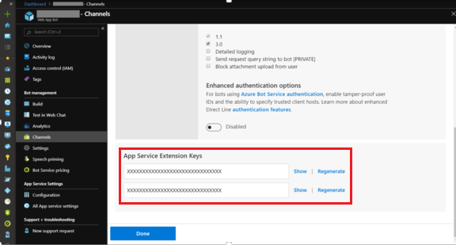

# Configure Node.js bot for extension

[!INCLUDE[applies-to-v4](includes/applies-to.md)]

This article describes how to update a bot to work with **named pipes**, and how to enable the direct line app service extension in the **Azure App Service** resource where the bot is hosted.  

## Prerequisites

In order to perform the steps described next, you must have **Azure App Service** resource and related **App Service** in Azure.

## Enable Direct Line App Service Extension

This section describes how to enable the direct line app service extension using keys from your bot’s channel configuration and the **Azure App Service** resource where your bot is hosted.

## Update Node.js Bot to use Direct Line App Service Extension

1. BotBuilder v4.7.0 or higher is required to use a Node.js bot with Direct Line App Service Extension.
1. To update an existing bot using v4.x of the SDK
    1. In the root directory of your bot run `npm install --save botbuilder` to update to the latest packages.
1. Allow your app to use the **Direct Line App Service Extension Named Pipe**:
    - Update the bot's index.js (below the assignment of the adapter and bot) to include:
    
    ```Node.js
    
    adapter.useNamedPipe(async (context) => {
        await myBot.run(context);
        },
        process.env.APPSETTING_WEBSITE_SITE_NAME + '.directline'
    );
    ```   

1. Save the `index.js` file.
1. Update the default `Web.Config` file to add the `AspNetCore` handler needed by Direct Line App Service Extension to service requests:
    - Locate the `Web.Config` file in the `wwwroot` directory of your bot and replace the default contents with:
    
    ```XML
    
    <?xml version="1.0" encoding="utf-8"?>
    <configuration>
      <system.webServer>
        <handlers>      
          <add name="aspNetCore" path="*/.bot/*" verb="*" modules="AspNetCoreModule" resourceType="Unspecified" />
          <add name="iisnode" path="*" verb="*" modules="iisnode" />
        </handlers>
       </system.webServer>
    </configuration>
    ```
    
1. Open the `appsettings.json` file and enter the following values:
    1. `"MicrosoftAppId": "<secret Id>"`
    1. `"MicrosoftAppPassword": "<secret password>"`

    The values are the **appid** and the **appSecret** associated with the service registration group.

1. **Publish** the bot to your Azure App Service.

### Gather your Direct Line App Service Extension keys

1. In your browser, navigate to the [Azure portal](https://portal.azure.com/)
1. In the Azure portal, locate your **Azure Bot Service** resource
1. Click on **Channels** to configure the bot’s channels
1. If it is not already enabled, click on the **Direct Line** channel to enable it. 
1. If it is already enabled, in the Connect to channels table click on the **Edit** link on the Direct Line row.
1. Scroll down to the **App Service Extension Keys** section. 
1. Click on the **Show link** to reveal one of the keys, then copy its value.



### Enable the Direct Line App Service Extension

1. In your browser, navigate to the [Azure portal](https://portal.azure.com/)
1. In the Azure portal, locate the **Azure App Service** resource page for the Web App where your bot is or will be hosted
1. Click on **Configuration**. Under the *Application settings* section, add the following new settings:

    |Name|Value|
    |---|---|
    |DirectLineExtensionKey|<App_Service_Extension_Key_From_Section_1>|
    |DIRECTLINE_EXTENSION_VERSION|latest|

1. Within the *Configuration* section, click on the **General** settings section and turn on **Web sockets**
1. Click on **Save** to save the settings. This restarts the Azure App Service.

### Confirm Direct Line App Extension and the Bot are Initialized

1. In your browser, navigate to https://<your_app_service>.azurewebsites.net/.bot. 
If everything is correct, the page will return this JSON content: `{"v":"123","k":true,"ib":true,"ob":true,"initialized":true}`. This is the information you obtain when **everything works correctly**, where

    - **v** displays the build version of the Direct Line App Service Extension (ASE).
    - **k** determines whether Direct Line ASE can read an App Service Extension Key from its configuration. 
    - **initialized** determines whether Direct Line ASE can use the App Service Extension Key to download the bot metadata from Azure Bot Service
    - **ib** determines whether Direct Line ASE can establish an inbound connection with the bot.
    - **ob** determines whether Direct Line ASE can establish an outbound connection with the bot. 
