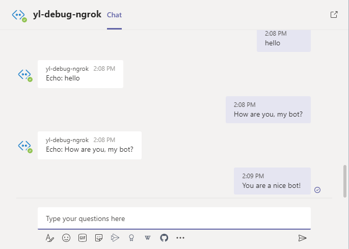
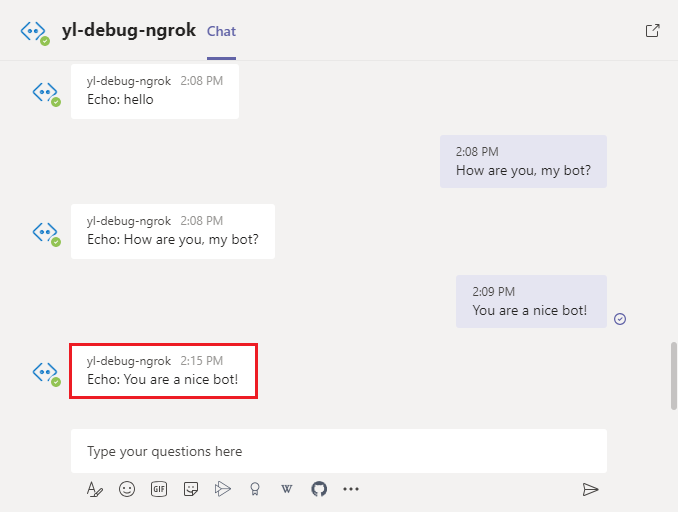

# Debug a bot from any channel using ngrok

When your bot is in development, you can [debug and your bot locally using an IDE](https://docs.microsoft.com/azure/bot-service/bot-service-debug-bot?view=azure-bot-service-4.0) such as Visual Studio or Visual Studio Code. You can also [debug a bot using the Bot Framework Emulator](https://docs.microsoft.com/azure/bot-service/bot-service-debug-emulator?view=azure-bot-service-4.0) by chatting with your bot locally and inspect the messages your bot sends and receives. You can even make slight updates of your bot's code and enable the feature to [debug a bot with inspection middleware](https://docs.microsoft.com/azure/bot-service/bot-service-debug-inspection-middleware?view=azure-bot-service-4.0).

When your bot is already in production, you can debug your bot from any [channel](https://docs.microsoft.com/azure/bot-service/bot-service-manage-channels?view=azure-bot-service-4.0) using **ngrok**. The seamless connection of your bot to multiple channels is a key feature available in Bot Framework. In this article, we will show how you can locally debug your bot from any channel your production bot is configured for, using **ngrok**.

<!-- the Bot Framework Emulator uses an instance of the [Web Chat control](https://github.com/Microsoft/BotFramework-WebChat), which is only used in DirectLine, or embedded into web sites using a standard or custom configuration. Popular third party channels such as Slack, Facebook Messenger, Kik, etc. all implement their own chat channel user interfaces. In this article, we’ll discuss how you can locally debug your bot from any channel your production bot is configured for, using [ngrok](https://ngrok.com/docs). -->

## Prerequisites

* A subscription to [Microsoft Azure](https://azure.microsoft.com/).
* Install [ngrok](https://ngrok.com/).
* A basic bot connected to any [channel](https://docs.microsoft.com/azure/bot-service/bot-service-manage-channels?view=azure-bot-service-4.0).

<!-- ## Create an Azure registration resource

You will need to create a Bot Channels Registration to register your local bot with Azure so that your local bot can be connected to any supported channel. If you already have an Azure registration resource, you can skip to the [run ngrok](#run-ngrok) section. 

### Create a Bot Channels Registration

1. Navigate to your [Azure portal](https://azure.microsoft.com) and select **+ Create a resource** on top of the menu.

2. Enter **Bot Channels Registration** in the search box and press **Enter**.

3. Select **Create** from the pop-up window and then fill in the creation form to create your **Bot Channels Registration**.

### Get the App ID and password

You will need to use the **App ID** and **password** generated during the previous process for application configuration. If you already have these values, you can skip to the next section to configure these values to your bot application. If you do not have these values, follow the steps: 

1. Select the **Bot Channels Registration** you just created and then select **Settings** from the left panel. The **App ID** is displayed in the **Microsoft App ID (Manage)** section.
    
    > [!div class="mx-imgBorder"]
    > 

2. Select **Manage** from **Microsoft App ID (Manage)** on the **Settings** page to generate a new **password**. 

3. Select **+New client secret** from the **Certificate & secrets** page. Enter some description in the **Description** field (this is optional) and select an expiration time from the **Expires** list. Select **Add**. 

    > [!div class="mx-imgBorder"]
    > 

4. Copy the value from the **Value** field of the displayed table. This is the generated **password** of your **Bot Channels Registration**.

    > [!div class="mx-imgBorder"]
    > 

For more information about creating a **Bot Channels Registration**, refer to the [Register a bot with Azure Bot Service](https://docs.microsoft.com/azure/bot-service/bot-service-quickstart-registration?view=azure-bot-service-3.0&viewFallbackFrom=azure-bot-service-4.0) article. -->

## Run ngrok

[**ngrok**](https://ngrok.com/docs) is a cross-platform application that "allows you to expose a web server running on your local machine to the internet." Essentially, what we’ll be doing is using **ngrok** to forward messages from external channels on the web directly to our local machine to allow debugging, as opposed to the standard messaging endpoint configured in the Azure portal.

1. Open a terminal and navigate to the folder where your **ngrok** executable is.

2. Run **ngrok** with the following command to create a new tunnel. 

    ```cmd
    ngrok http 3978 -host-header="localhost:3978"

    ```

    > [!NOTE]
    > Please note that the port specified is the port your bot is running on. You may use any localhost port you'd like.

3. When **ngrok** starts, copy and save the public forwarding URL for later. 
   
    > [!div class="mx-imgBorder"]
    > 

## Configure in Azure portal

While **ngrok** is running, login to your Azure portal and view your bot settings to do some configuration.

1. Select your **Bot Channels Registration** connected to your local bot.

2. Scroll down to **Configuration**. Copy and paste the **ngrok** forwarding url in the **Messaging endpoint** field. Ensure that you maintain "/api/messages" at the end of the URL.
   
    

3. Scroll up and select **Save**.

## Test

At this point, incoming messages from to your bot from external channels will now be sent to your local bot. The sample bot we’ll use to demonstrate this is already configured live for **Microsoft Teams**. Read [Connect a bot to Microsoft Teams](https://docs.microsoft.com/azure/bot-service/channel-connect-teams?view=azure-bot-service-4.0) about connecting a local bot with **Microsoft Teams** channel.

> [!div class="mx-imgBorder"]
> 

Locally, you can set breakpoints in Visual Studio. Expanding the text property from the incoming activity object, you will see that the message you sent the bot from teams is being intercepted locally for you to debug.

> [!div class="mx-imgBorder"]
> 

From here you can debug normally, and run your code step by step. You can use this to debug your bot from any channel.

> [!div class="mx-imgBorder"]
> 

## Additional information
* [Connect a bot to channels](https://docs.microsoft.com/azure/bot-service/bot-service-manage-channels?view=azure-bot-service-4.0)