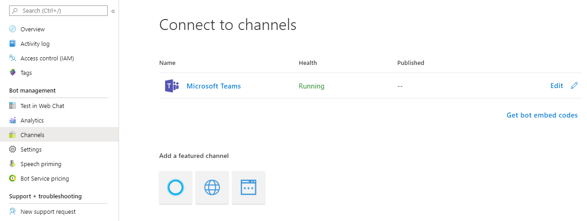

# Connect a bot to channels

A channel is a connection between a bot and communication applications. The Bot Framework, configured through the Azure portal, connects a bot to these channels to facilitate the communication between a bot and the user. The [Bot Connector service](~/rest-api/bot-framework-rest-connector-quickstart.md)  enables a bot to exchange messages with channels that are configured in the <a href="https://portal.azure.com" target="_blank">Azure Portal</a>, by using REST and JSON over HTTPS.

You can configure a bot to connect to any of the provided standard channels such as Alexa, Cortana, Facebook Messenger, Kik, and Slack, and so on.

In addition to the provided channels, you can also connect a bot to your communication application using **Direct Line** as the channel.

The Bot Framework allows you to develop a bot in a channel-agnostic way by normalizing messages that the bot sends to a channel. This involves the following:

- Convert the messages from the Bot Framework schema into the channel's schema.
- If the channel does not support all aspects of the Bot Framework schema, the Bot Connector service tries to convert the message to a format that the channel does support. For example, if the bot sends a message that contains a card with action buttons to the email channel, the connector may send the card as an image and include the actions as links in the message's text.
- For most channels, you must provide channel configuration information to run a bot on the channel. Most channels require that a bot have an account on the channel. Others, like Facebook Messenger, require a bot to have an application registered with the channel also.

To configure a bot to connect to a channel, complete the following steps:

1. Sign in to the <a href="https://portal.azure.com" target="_blank">Azure Portal</a>.
2. Select the bot that you want to configure.
3. In the Bot Service blade, click **Channels** under **Bot Management**.
4. Click the icon of the channel you want to add to your bot.

    

After you've configured the channel, users on that channel can start using your bot.

## Connect a bot to a channel

The connection steps are different for each channel, see the related article for details.

> [!div class="mx-tdBreakAll"]
> |Channel|Description|
> |-------------|----------|
> |[Alexa](bot-service-channel-connect-alexa.md)|Communicate with people using Alexa devices that support Custom Skills.|
> |[Cortana](bot-service-channel-connect-cortana.md)|Cortana is a speech-enabled channel that can send and receive voice messages in addition to textual conversation.|
> |[Direct Line](bot-service-channel-directline.md)|Direct Line allows the integration of a bot into a mobile app, web page, or other applications.|
> |[Office 365 email](bot-service-channel-connect-email.md)|Enables a bot to communicate with users via Office 365 email.|
> |[Facebook](bot-service-channel-connect-facebook.md)|Connect a bot to both Facebook Messenger and Facebook Workplace, so that it can communicate with users on both platforms.|
> |[Kik](bot-service-channel-connect-groupMe.md)|Configure a bot to communicate with people using the Kik messaging app.|
> |[LINE](bot-service-channel-connect-line.md)|Configure a bot to communicate with people through the LINE app.|
> |[Microsoft Teams](channel-connect-teams.md)|Configure a bot to communicate with people through Microsoft Teams.|
> |[Skype](bot-service-channel-connect-skype.md)|Configure a bot to communicate with people through Skype.|
> |[Skype for Business](bot-service-channel-connect-skypeforbusiness.md)|Configure a bot to communicate with people through Skype for Busines.|
> |[Slack](bot-service-channel-connect-slack.md)|Configure a bot to communicate with people through Slack.|
> |[Telegram](bot-service-channel-connect-telegram.md)|Configure a bot to communicate with people through Telegram.|
> |[Twilio](bot-service-channel-connect-twilio.md)|Configure a bot to communicate with people using the Twilio cloud communication platform.|
> |[WeChat](bot-service-channel-connect-wechat.md)|Configure a bot to communicate with people using the WeChat platform.|
> |[Web Chat](bot-service-adapter-connect-webex.md)|When creating a bot with the Framework Bot Service, the Web Chat channel is automatically configured for you.|
> |[Webex](bot-service-adapter-connect-webex.md)|Configure a bot to communicate with people using the Webex.|
> |[Additional channels](bot-service-channel-additional-channels.md)|Additional channels available as an adapter, both through our [provided platforms](https://botkit.ai/docs/v4/platforms/) via Botkit, or accessible through the [community repositories](https://botkit.ai/docs/v4/platforms/)|

## Publish a bot
The publishing process is different for each channel.

[!INCLUDE [publishing](./includes/snippet-publish-to-channel.md)]

## Additional resources

The SDK includes samples that you can use to build bots. Visit the [Samples repo on GitHub](https://github.com/Microsoft/BotBuilder-samples) to see a list of samples.
