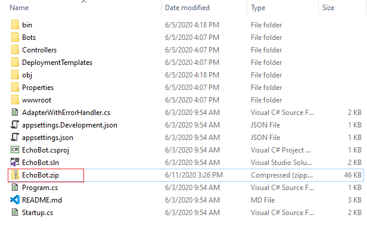

# Deployment Frequently Asked Questions

This article contains answers to some frequently asked questions about how to deploy a bot to Azure covered in [this article](https://docs.microsoft.com/azure/bot-service/bot-builder-deploy-az-cli?view=azure-bot-service-4.0). You will find the answers to the following questions: 

- [Zip up the code directory](#zip-up-the-code-directory)
  - [What files do we need to zip up?](#what-files-do-we-need-to-zip-up)
- [Azure CLI command deprecation](#azure-cli-command-deprecation)
  - [What Azure CLI version should I use to deploy a bot?](#what-azure-cli-version-should-i-use-to-deploy-a-bot)
  - [What should I do when getting Azure CLI deprecation errors?](#what-should-i-do-when-getting-azure-cli-deprecation-errors)
  - [What are the deprecated commands related to `az deployment`?](#what-are-the-deprecated-commands-related-to-az-deployment)
  - [How do I know whether the Azure CLI commands are deprecated?](#how-do-i-know-whether-the-azure-cli-commands-are-deprecated)
- [Additional information](#additional-information)
    - [Azure CLI Change Log](#azure-cli-change-log)
    - [ARM](#arm)

## Zip up the code directory

### What files do we need to zip up?

In the [zip up the code directory manually step](https://docs.microsoft.com/azure/bot-service/bot-builder-deploy-az-cli?view=azure-bot-service-4.0&tabs=csharp#52-zip-up-the-code-directory-manually) of the [deploy a bot to Azure](https://docs.microsoft.com/azure/bot-service/bot-builder-deploy-az-cli?view=azure-bot-service-4.0) article, you will need to manually zip up the files.

Please make sure that you select all the files and folders in your bot's project folder. Then, still in the bot's project folder, zip up all the selected files and folders. For example:

> [!div class="mx-imgBorder"]
> 

Then you will have a `.zip` file (the name may differ) such as this one:

> [!div class="mx-imgBorder"]
> 

After that, you can run the command to deploy your bot. 

## Azure CLI command deprecation

### What Azure CLI version should I use to deploy a bot?

It is recommended that you use the most latest version of the [Azure CLI](https://docs.microsoft.com/cli/azure/install-azure-cli?view=azure-cli-latest) to complete the deployment process. If you are using older versions of Azure CLI, you will get deprecation errors in the process.

### What should I do when getting Azure CLI deprecation errors?

You should upgrade to the most latest version of the [Azure CLI](https://docs.microsoft.com/cli/azure/install-azure-cli?view=azure-cli-latest). For Azure CLI version [2.2.0](https://github.com/MicrosoftDocs/azure-docs-cli/blob/master/docs-ref-conceptual/release-notes-azure-cli.md#march-10-2020) or later, users should use `az deployment sub create` and `az deployment group create` instead of using `az deployment create` and `az group deployment create` respectively.

#### Change log of the Azure CLI commands used to deploy a bot to Azure

|Azure ClI version | Command1 | Command 2|
|-------|-------|-------|
|Azure CLI 2.2.0 and later versions | `az deployment group create` | `az deployment sub create` |
|Azure CLI 2.1.0 and earlier versions | `az group deployment create` | `az deployment create` |

Read more in the [Azure CLI change log](https://github.com/MicrosoftDocs/azure-docs-cli/blob/master/docs-ref-conceptual/release-notes-azure-cli.md).

### What are the deprecated commands related to `az deployment`?

The deprecated Azure CLI commands related to `az deployment` are the following:

1. `az deployment create/list/show/delete/validate/export/cancel` --> `az deployment sub create/list/show/delete/validate/export/cancel`
2. `az deployment operation list/show` --> `az deployment operation sub list/show`
3. `az group deployment create/list/show/delete/validate/export/cancel` --> `az deployment group create/list/show/delete/validate/export/cancel`
4. `az group deployment operation list/show` --> `az deployment operation group list/show`

### How do I know whether the Azure CLI commands are deprecated?

To know whether Azure CLI commands are deprecated or not, you can add `-h` after the executed command to check. For example, if you have a newer version of Azure CLI but execute a deprecated command (with `-h`) such as `az deployment create -h`, you will see a prompt message such as "This command has been deprecated and will be removed in a future release. Use 'deployment sub create' instead."

## Additional information

### Azure CLI Change Log

Read more about [Azure CLI change log](https://github.com/MicrosoftDocs/azure-docs-cli/blob/master/docs-ref-conceptual/release-notes-azure-cli.md).

### ARM

Here is a list of a consolidation of the commands to better fit the current command design of Azure CLI: az {command group} {?sub-command-group} {operation} {parameters}.

* `az resource`: Improve the examples of the resource module
* `az policy assignment list`: Support listing policy assignments at Management Group scope
* Add `az deployment group` and `az deploymnent operation group` for template deployment at resource groups. This is a duplicate of `az group deployment` and `az group deployment operation`. 
* Add `az deployment sub` and `az deployment operation sub` for template deployment at subscription scope. This is a duplicate of `az deployment` and `az deployment operation`.
* Add `az deployment mg` and `az deployment operation mg` for template deployment at management groups 
* Add `ad deployment tenant` and `az deployment operation tenant` for template deployment at tenant scope 
* az policy assignment create: Add a description to the `--location` parameter
* `az group deployment create`: Add parameter `--aux-tenants` to support cross tenants. 
