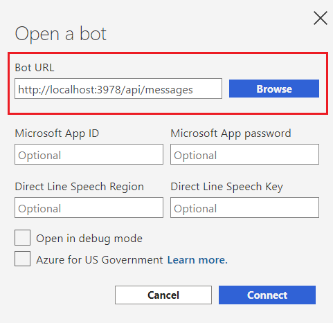
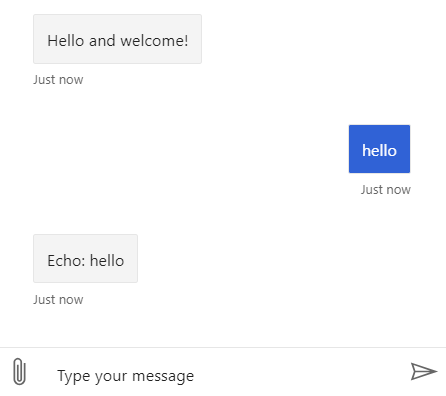

## Prerequisites

- [Visual Studio 2019 or later](https://www.visualstudio.com/downloads)
- [Bot Framework SDK v4 template for C#](https://aka.ms/bot-vsix)
- [.NET Core 3.1](https://dotnet.microsoft.com/download)
- [Bot Framework Emulator](https://aka.ms/bot-framework-emulator-readme)
- Knowledge of [ASP.Net Core](https://docs.microsoft.com/aspnet/core/) and [asynchronous programming in C#](https://docs.microsoft.com/dotnet/csharp/programming-guide/concepts/async/index)


# [Azure AD v1](#tab/adv1)

### Azure AD v1

Install [BotBuilderVSIX.vsix template](https://aka.ms/bot-vsix) that you downloaded in the prerequisites section.

In Visual Studio, create a new bot project using the **Echo Bot (Bot Framework v4 - .NET Core 3.1)** template. Choose **AI Bots** from the project types to show only bot templates.

> [!div class="mx-imgBorder"]
> 

Thanks to the template, your project contains all the code that's necessary to create the bot in this quickstart. You don't need any additional code to test your bot.

> [!NOTE]
> If you create a `Core` bot, you'll need a LUIS language model. (You can create a language model at [luis.ai](https://www.luis.ai)). After creating the model, update the configuration file.

[!INCLUDE [dotnet vsix templates info](~/includes/vsix-templates-versions.md)]

# [Azure AD v2](#tab/adv2)

### Azure AD v2

test

---

# [VS templates](#tab/vst)

### Visual Studio templates

Install [BotBuilderVSIX.vsix template](https://aka.ms/bot-vsix) that you downloaded in the prerequisites section.

In Visual Studio, create a new bot project using the **Echo Bot (Bot Framework v4 - .NET Core 3.1)** template. Choose **AI Bots** from the project types to show only bot templates.

> [!div class="mx-imgBorder"]
> 

Thanks to the template, your project contains all the code that's necessary to create the bot in this quickstart. You don't need any additional code to test your bot.

> [!NOTE]
> If you create a `Core` bot, you'll need a LUIS language model. (You can create a language model at [luis.ai](https://www.luis.ai)). After creating the model, update the configuration file.

[!INCLUDE [dotnet vsix templates info](~/includes/vsix-templates-versions.md)]

# [CL templates](#tab/clt)

### Command Line templates

.NET Core Templates will help you to quickly build new conversational AI bots using Bot Framework v4. As of May 2020, these templates and the code they generate require .NET Core 3.1.

In a console window perform the steps shown below.

1. Install [.NET Core SDK](https://dotnet.microsoft.com/download) version 3.1 or higher.
1. Determine dotnet version.

   ```cmd
   dotnet --version
   ```

1. Install Bot Framework CSharp 3 templates (echo, core, empty).

   ```cmd
   dotnet new -i Microsoft.Bot.Framework.CSharp.EchoBot
   dotnet new -i Microsoft.Bot.Framework.CSharp.CoreBot
   dotnet new -i Microsoft.Bot.Framework.CSharp.EmptyBot
   ```

1. Verify the templates have been installed correctly.

   ```cmd
   dotnet new --list
   ```

> [!NOTE]
> The above installation steps will install all three Bot Framework templates. If you prefer to install one template or a subset of the three templates, install them individually.

 For more information, see [.NET Core SDK Templates](https://github.com/microsoft/BotBuilder-Samples/tree/master/generators/dotnet-templates#net-core-sdk-templates).

---

## Start your bot in Visual Studio

Start your project in Visual Studio. This will build the application, deploy it to localhost, and launch the web browser to display the application's `default.htm` page.

At this point, your bot is running locally on port 3978.

## Start the Emulator and connect to your bot

Next, start the emulator and then connect to your bot in the emulator:

1. Start the Bot Framework Emulator.

2. Click **Open Bot** on the Emulator's **Welcome** tab.

3. Enter your bot's URL, which is the URL of the local port, with /api/messages added to the path, typically `http://localhost:3978/api/messages`.

   <!--This is the same process in the Emulator for all three languages.-->
   

4. Then click **Connect**.

   Send a message to your bot, and the bot will respond back with a message.

   > [!div class="mx-imgBorder"]
   > 

<!--
> [!NOTE]
> If you see that the message cannot be sent, you might need to restart your machine as ngrok didn't get the needed privileges on your system yet (only needs to be done one time).
-->
