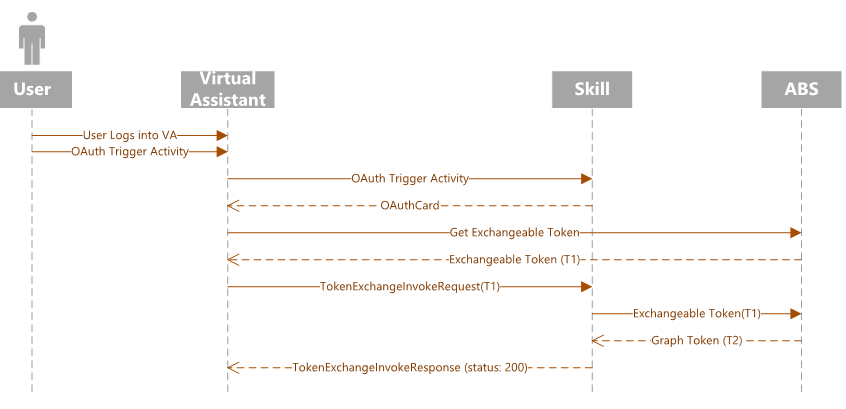
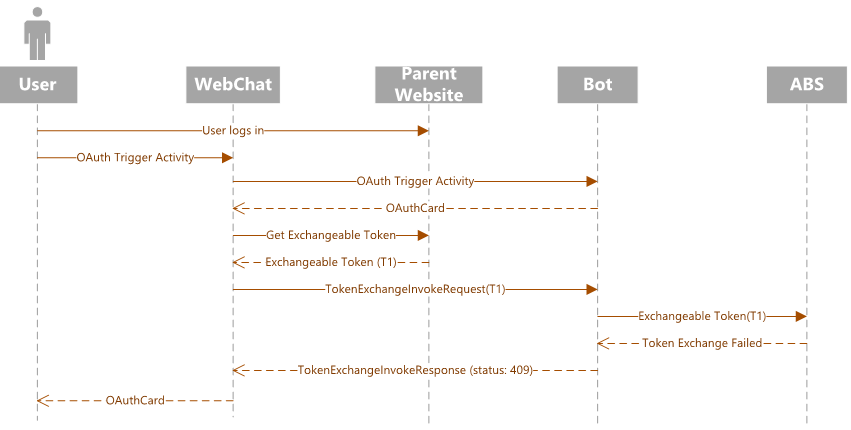

# Single sign on

Single Sign on (SSO) allows a client, such as virtual assistant, WebChat and so on, to communicate with a bot or skill on behalf of the user.
Currently, only the [Azure AD v2](./bot-builder-concept-identity-providers.md#azure-active-directory-identity-provider) identity provider is supported.

SSO applies to the following scenarios:

- Virtual assistant and multiple skill bot. The user can sign in once into the virtual assistant. The assistant then invokes multiple skills on behalf of the user.
- Webchat embedded into a website. The user sign in the website. The website then invokes a bot or a skill on behalf of the user.

SSO provides the following advantages:

- The user does not have to login over again, if already signed in a virtual assistant or website.
- The virtual assistant or website do not have knowledge of user permissions.

## SSO components interaction

The following time sequence diagrams show the interactions between the SSO various components.

### Normal flow

The following diagram shows a normal flow when using a virtual assistant client.



### Fallback flow

The following shows a fallback flow when using a WebChat client.
SSO falls back to the existing behavior of showing the OAuth card.
The failure may be caused for example if the user consent is required or if the token exchange fails.



Let's analyse the flow.

1. The client starts a conversation with the bot triggering an OAuth scenario.
1. The bot sends back an OAuth Card to the client.
1. The client intercepts the OAuth card before displaying it to the user and checks if it contains a `TokenExchangeResource` property.
1. If the property exisists, the client sends a `TokenExchangeInvokeRequest` to the bot. The client must have an exchangeable token for the user, which must be an Azure AD v2 token and whose audience must be the same as `TokenExchangeResource.Uri` property. For an example on how to get the user's exchangeable token, please refer to this [Webchat Sample (TBD)](https://linkrequired). The client sends an Invoke activity to the bot with the body shown below.

    ```json
    {
        "type": "Invoke",
        "name": "signin/tokenExchange",
        "value": {
            "id": "<any unique Id>",
            "connectionName": "<connection Name on the skill bot (from the OAuth Card)>",
            "token": "<exchangeable token>"
        }
    }
    ```

1. The bot processes the `TokenExchangeInvokeRequest` and returns a `TokenExchangeInvokeResponse` back to the client. The
client should wait till it receives the `TokenExchangeInvokeResponse`.

    ```json
    {
        "status": "<response code>",
        "body": {
            "id":"<unique Id>",
            "connectionName": "<connection Name on the skill bot (from the OAuth Card)>",
            "failureDetail": "<failure reason if status code is not 200, null otherwise>"
        }
    }
    ```

1. If the `TokenExchangeInvokeResponse` has a `status` of `200`, then the client does not show the OAuth card. See the *normal flow* diagram. For any other `status` or if the `TokenExchangeInvokeResponse` is not received, then the client shows the OAuth card to the user. See the *fallback flow* diagram. This ensures that the SSO flow falls back to normal OAuthCard flow, in case of any errors or unmet dependencies like user consent.

> [!WARNING]
> The next section belong to a how to (sample) article (TBD).

## Create Azure AD applications

Currently SSO in botframework is only supported for aadV2 apps.
We need to create 2 applications - one for the client and one for the Bot.
Depending on the scenario, the client may be webchat or a virtual assistant.
The general case for a Bot would be a skill Bot.

## Client Azure AD app

The client AAD application will be used to create an exchangeable token that will be passed onto the bot.
For an example of how to create an AAD app, look at the [bot builder authentication docs](https://docs.microsoft.com/azure/bot-service/bot-builder-authentication?view=azure-bot-service-4.0&tabs=csharp#create-your-azure-ad-application).

## Service Azure AD app

1) Follow the steps on [Create your Azure AD application](https://docs.microsoft.com/azure/bot-service/bot-builder-authentication?view=azure-bot-service-4.0&tabs=csharp#create-your-azure-ad-application).
2) In the **Expose an api** panel, click **Add a scope**
    - Fill in the fields
    - Click the **Add scope button**.
    - Click the **Add a client application** button, and enter the app Id for the client AAD app. Select the Scope that you created in the previous step. This ensures that the user will not be asked to consent when the client tries to get an exchangeable token for this app's scope
3) In the **Manifest** panel, set the `accessTokenAcceptedVersion` key to be `2`.

## Service Auth Connection

1) Follow the directions in the [bot builder authentication doc](https://docs.microsoft.com/azure/bot-service/bot-builder-authentication?view=azure-bot-service-4.0&tabs=csharp#azure-ad-v2)
2) In the **Expose an api** panel, copy the scope that you added earlier. Fill it in the **Token Exchange Uri** field.
3) Save the connection setting.