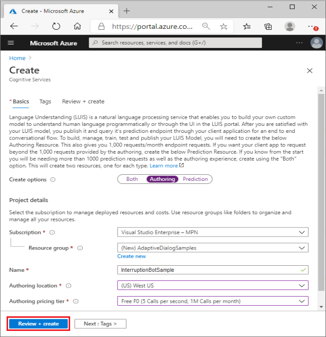
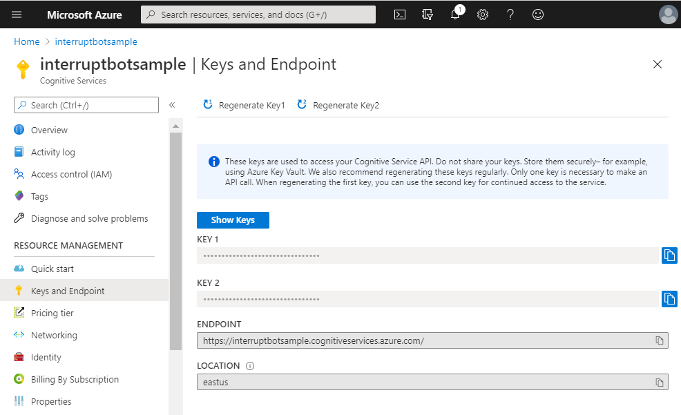

# How to deploy LUIS resources using the Bot Framework SDK LUIS CLI commands

[!INCLUDE [applies-to-v4](../includes/applies-to.md)]

The Bot Framework SDK Command Line Interface (CLI) lets you automate the management of LUIS applications (LUIS apps). It lets you create, update, and delete LUIS properties from the command line or a script. This article explains how to deploy a LUIS app and models to a LUIS authoring resource in Azure.

## Prerequisites

- Knowledge of [LU templates][lu-templates].
- Have a bot project with `.lu` files.
- If working with adaptive dialogs, you should have an understanding of:
    - [Natural Language Processing in adaptive dialogs][natural-language-processing-in-adaptive-dialogs].
    - [Language Understanding in adaptive dialogs][language-understanding].
    - how the [LUIS recognizer][luis-recognizer] is used.

## Using the LUIS CLI commands to enable LUIS in your bot

This article describes how to perform some common tasks using the Bot Framework CLI.

1. [Create your LUIS authoring resource in Azure](#create-your-luis-authoring-resource-in-azure)
1. [Install the Bot Framework SDK CLI](#install-the-bot-framework-sdk-cli)
1. [Create your LUIS model](#create-your-luis-model)
1. [Create your LUIS application](#create-your-luis-application)
1. [Get the appId from your LUIS app](#get-the-appid-from-your-luis-app)
1. [Train your LUIS application](#train-your-luis-application)
1. [Publish your LUIS application](#publish-your-luis-application)
1. [Generate source code](#generate-source-code)

Once your bot project's language understanding resources have been created, you are ready to follow the steps outlined in this article to get LUIS working.

## Create your LUIS authoring resource in Azure

The LUIS authoring resource is an [Azure Cognitive Services][cognitive-services-overview] resource that you create using Azure's [Create Cognitive Services][create-cognitive-services] page. You can think of this as a container for your LUIS applications and the model, or models that those LUIS applications are comprised of. The LUIS authoring resource provides a secure way to author your LUIS resources.  You need this to be able to perform the activities involved, such as create, update, train, and publish a LUIS app. The Bot Framework CLI LUIS group provides the commands you need to accomplish these tasks.

1. Go to the Azure [Create Cognitive Services][create-cognitive-services] page.  
2. In the **Create options** section, select **Authoring** to create a LUIS authoring resource.

   

3. Enter values for each of the fields, then select the **Review + create** button.

   

    > [!NOTE]
    > When entering the **Resource Group** and **Name**, keep in mind that you cannot change these values later. Also note that the value you give for **Name** will be part of your **Endpoint URL**.

4. Review the values to ensure they are correct, then select the **Create** button.

The LUIS authoring resource includes information your bot will use to access your LUIS app:

- **Keys**. These are called _subscription keys_, sometimes referred to as _authoring keys_ when referring to keys in the LUIS authoring resource. These are auto generated. You will need an authoring key when referencing your LUIS authoring resource for any action, such as when creating your LUIS App and Models which will be detailed in this article. You can find the keys in the **Keys and Endpoint** blade in your LUIS authoring resource.
- **Endpoint**. This is auto-generated using the LUIS authoring resource name that you provide when creating it. It has the following format: `https://<luis-resource-name>.cognitiveservices.azure.com/`. When referencing your LUIS authoring resource for any action, such as when creating your LUIS App and Models which will be detailed in this article. You can find the key in the **Keys and Endpoint** blade in your LUIS authoring resource.
- **Location**.   This is the Azure region that contains your LUIS authoring resource. You select this when creating the LUIS authoring resource.

   

> [!TIP]
>
> There are two types of subscription keys associated with a LUIS resource, depending on which type of LUIS resource you are referring to. A LUIS authoring resource has an authoring key and a LUIS prediction resource has a prediction key, both are subscription keys and both can be found in the _Keys and endpoint_ blade.

For more information on see [Create LUIS resources][luis-how-to-azure-subscription].

## Install the Bot Framework SDK CLI

The Bot Framework CLI requires [Node.js](https://nodejs.org/en/).

1. Make sure you have the latest version of npm installed:

    ~~~bash
    npm i -g npm
    ~~~

1. Using Node.js, install the latest version of the Bot Framework CLI from the command line.

    ```bash
    npm i -g @microsoft/botframework-cli
    ```

For more information see [Bot Framework CLI tool][bf-cli-overview].

## Create your LUIS model

Once you have created all the individual `.lu` files needed in your project, you can combine them to create your LUIS model using the `luis:convert` command. This results in a JSON file that you will reference when creating your LUIS application hosted in Azure Cognitive Services in the _LUIS authoring resource_ you created previously.

``` cli
bf luis:convert -i <input-folder-name> -o <output-file-name> -r
```

In the example below, the command is run in a command line while in the root directory of your project. It will search for all `.lu` files in the _dialogs_ directory and because of the `-r` option, all of its sub-directories. It will save a file named LUISModel.json in the _output_ directory.

``` cli
bf luis:convert -i dialogs -o .\output\LUISModel.json -r
```

## Create your LUIS application

The _LUIS authoring resource_ you perviously created consists of your authoring keys and endpoint, values that you need when creating your LUIS application (LUIS app). You can have multiple LUIS apps associated with a single LUIS authoring resource, each LUIS app will have its own `appId` that will be provided to you as a part of the creation process. You will need that `appId` when referring to this LUIS app in the future. The LUIS app will provide your bot with all functionality provided by LUIS, combined with the app specific data you provide in your LUIS model that you previously created from your projects `.lu` files.

To create your LUIS app:

``` cli
luis:application:import --in <luis-model-json-file> --endpoint <endpoint> --subscriptionKey <subscription-key> --name <name> --versionId <initial-version-id>
```

The example above shows the `luis:application:import` command with its required options. For more details and to see all options available for this command see the [bf luis:application:import][bf-luisapplicationimport] section of the LUIS CLI readme.

To create a LUIS application without including a LUIS model see the [bf luis:application:create][bf-luisapplicationcreate] command.


In the above image, you would use the following command to create your LUIS app, assuming your LUIS model JSON file is in a sub-directory named _output_:

`luis:application:import --in .\output\LUISModel.json --endpoint https://LUIS-Authoring-Resource.cognitiveservices.azure.com/ --subscriptionKey xxxxxxxxxxxxxxxxxxxxxxxxxxxxxxxx --name LUISApplication --versionId 0.1`

> [!NOTE]
>
> The keys in the image above are not valid keys. They are shown here for demonstration purposes only.
> These authoring keys offer you a secure way to access your LUIS authoring resources. Do not share your keys.

## Get the appId from your LUIS app

You will need the `appId` that is returned when the `luis:application:import` command successfully completes, you will also need the `versionId` that you supplied when creating the LUIS application. In scenarios where you do not have this information, or if you are creating scripts to automate this process, you can use the [luis:application:show][bf-luisapplicationshow] command to get this information.

``` cli
bf luis:application:show --appId <application-id> --endpoint <endpoint> --subscriptionKey <subscription-key>
```

## Train your LUIS application

Training is the process of teaching your LUIS app to improve its natural language understanding. You need to train your LUIS app after you have made any updates to the model such as adding, editing, labeling, or deleting entities, intents, or utterances. For additional information see the [Train your active version of the LUIS app][luis-how-to-train] article in the LUIS docs.

To train your LUIS app, use the `luis:train:run` command:

```cli
bf luis:train:run --appId <application-id> --versionId <version-id> --endpoint <endpoint> --subscriptionKey <subscription-key>
```

This enables you to automate what you would normally do in the LUIS site:


For additional information on using this command, see [bf luis:train:run][bf-luistrainrun] in the BF CLI LUIS readme.

> [!TIP]
>
> After training your LUIS app, you should [test][luis-concept-test] it with sample utterances to see if the intents and entities are recognized correctly. If they're not, make updates to the LUIS app, train, and test again. This testing can be done manually in the LUIS site, for more information see the article [Test an utterance][test-an-utterance].

## Publish your LUIS application

When you finish building, training, and testing your active LUIS app, make it available to your client application by publishing it to the endpoint. You can do that using the `luis:application:publish` command

```cli
bf luis:application:publish --appId <application-id> --versionId <version-id> --endpoint <endpoint> --subscriptionKey <subscription-key>
```

For additional information on using this command, see [bf luis:application:publish][luisapplicationpublish] in the BF CLI LUIS readme.

For information about publishing a LUIS application, see [Publish your active, trained app to a staging or production endpoint][luis-how-to-publish-app].

## Generate source code

### Generate a C# class for the model results

The `luis:generate:cs` command can be used to generate a strongly typed C# source code from a LUIS model (JSON).

Run the following command to create a .cs representation of your LUIS model:

```cli
bf luis:generate:cs -i <luis-model-file> -o <output-file-name> --className <class-name>
```

For additional information on using this command, see [bf luis:generate:cs][bf-luisgeneratecs] in the BF CLI LUIS readme.

### Generate a TypeScript type for the model results

The `luis:generate:ts` command can be used to generate a strongly typed typescript source code from a LUIS model (JSON).

Run the following command to create a .ts representation of your LUIS model:

```cli
bf luis:generate:ts -i <luis-model-file> -o <output-file-name> --className <class-name>
```

For additional information on using this command, see [bf luis:generate:ts][bf-luisgeneratets] in the BF CLI LUIS readme.

<!-------------------------------------------------------------------------------------------------------------------------
## Additional information

- [Updating your LUIS Models][]
--------------------------------------------------------------------------------------------------------------------------->

<!----------------------------------------------------------------------------------------------------------------------------->
[cognitive-services-overview]: /azure/cognitive-services/Welcome
[create-cognitive-services]: https://portal.azure.com/#create/Microsoft.CognitiveServicesLUISAllInOne
[luis-recognizer]: bot-builder-concept-adaptive-dialog-recognizers.md#luis-recognizer
[natural-language-processing-in-adaptive-dialogs]: bot-builder-concept-adaptive-dialog-recognizers.md#introduction-to-natural-language-processing-in-adaptive-dialogs
[language-understanding]: bot-builder-concept-adaptive-dialog-recognizers.md#language-understanding
[lu-templates]: ../file-format/bot-builder-lu-file-format.md
[luis-how-to-azure-subscription]: /azure/cognitive-services/luis/luis-how-to-azure-subscription
[bf-cli-overview]: bf-cli-overview.md

[bf-luisapplicationimport]: https://aka.ms/botframework-cli#bf-luisapplicationimport
[bf-luisapplicationcreate]: https://aka.ms/botframework-cli#bf-luisapplicationcreate
[bf-luisapplicationshow]: https://aka.ms/botframework-cli#bf-luisapplicationshow
[bf-luistrainrun]: https://aka.ms/botframework-cli#bf-luistrainrun
[luisapplicationpublish]: https://aka.ms/botframework-cli#bf-luisapplicationpublish
[bf-luisgeneratecs]: https://aka.ms/botframework-cli#bf-luisgeneratecs
[bf-luisgeneratets]: https://aka.ms/botframework-cli#bf-luisgeneratets

[luis-how-to-add-intents]: /azure/cognitive-services/LUIS/luis-how-to-add-intents
[luis-how-to-start-new-app]: /azure/cognitive-services/LUIS/luis-how-to-start-new-app
[luis-how-to-train]: /azure/cognitive-services/LUIS/luis-how-to-train
[luis-concept-test]: /azure/cognitive-services/LUIS/luis-concept-test
[test-an-utterance]: /azure/cognitive-services/LUIS/luis-interactive-test#test-an-utterance
[luis-interactive-test]: /azure/cognitive-services/LUIS/luis-interactive-test
[luis-how-to-publish-app]: /azure/cognitive-services/LUIS/luis-how-to-publish-app

<!----------------------------------------------------------------------------------------------------------------------------->
